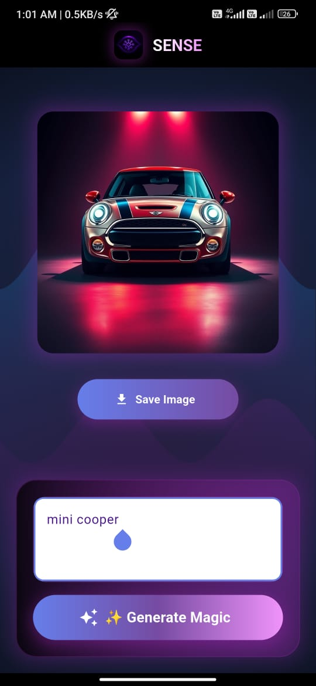
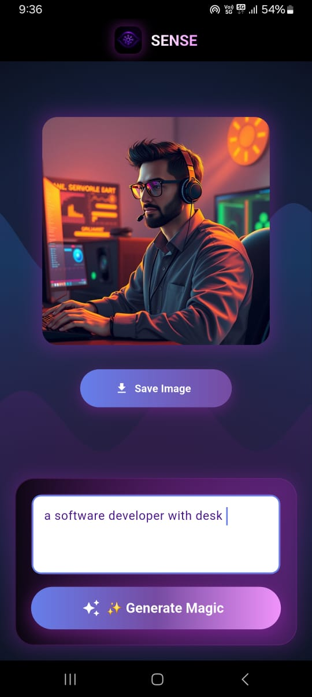
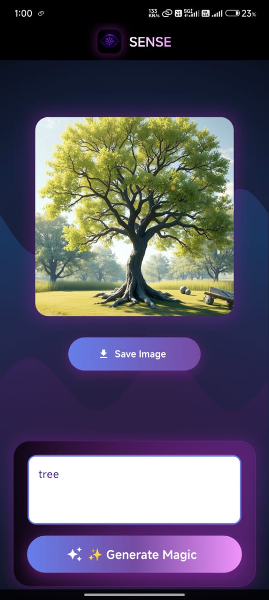

# 🎨 SENSE - AI Image Generator

**A sophisticated Flutter application for AI-powered text-to-image generation with modern UI/UX design.**


---

<h2 align="center">🖼️ Sample Generated Images</h2>

<p align="center">
  
  
  
</p>


## 📱 Project Overview

**SENSE** is an AI-powered image generation mobile app that transforms text prompts into stunning visual artwork using state-of-the-art AI models. The app features a modern, futuristic UI with glassmorphism effects, animated backgrounds, and intuitive user experience.

### 🎯 Key Features
- ✨ **AI Text-to-Image Generation** - Transform descriptions into artwork
- 🎨 **Multiple AI Models** - Primary Together AI + fallback APIs
- 🚀 **Modern UI/UX** - Glassmorphism, gradients, and animations
- 🔄 **Futuristic Loading** - Multi-layered animated spinners
- 🌊 **Dynamic Backgrounds** - Animated purple wave patterns
- 📱 **Cross-Platform** - Android (iOS ready)

---

## 🏗️ Technical Architecture

### Core Technologies

| Technology | Version | Purpose |
|------------|---------|---------|
| **Flutter** | Latest | Cross-platform mobile framework |
| **Dart** | Latest | Programming language |
| **BLoC Pattern** | ^8.1.2 | State management |
| **HTTP** | ^0.13.6 | API communication |
| **Meta** | ^1.16.0 | Annotations and utilities |

### AI/API Integration

| Service | Type | Purpose |
|---------|------|---------|
| **Together AI** | Primary | FLUX.1 model for high-quality generation |
| **Pollinations.ai** | Fallback | Alternative image generation |
| **Picsum Photos** | Fallback | Dynamic placeholder images |
| **Custom Generator** | Fallback | Synthetic image generation |


## 🔧 Project Structure

```

imagegenerator/
├── android/
│   └── app/src/main/AndroidManifest.xml
├── assets/
│   └── logo.png
├── lib/
│   ├── main.dart
│   ├── splash_screen.dart
│   └── feature/prompt/
│       ├── bloc/
│       │   ├── prompt_bloc.dart
│       │   ├── prompt_event.dart
│       │   └── prompt_state.dart
│       ├── repos/
│       │   └── prompt_repo.dart
│       └── ui/
│           └── create_prompt_screen.dart
├── pubspec.yaml
└── README.md


````

---

## 🎨 Design System

### Color Palette

```dart
Primary: #667eea
Secondary: #764ba2
Tertiary: #f093fb
Background: Black with radial gradients
Text: White with gradient shaders
Accent: Purple glows and shadows
````

### UI Components

* 🌊 **Animated Wave Background**
* 💫 **Glassmorphism Cards**
* ⭐ **Gradient Text**
* 🎪 **Futuristic Loading**
* 🎯 **Input Fields**

---

## 🚀 State Management (BLoC)

### Events

```dart
PromptInitialEvent()
PromptEnteredEvent(prompt)
```

### States

```dart
PromptInitial()
PromptGeneratingImageLoadState()
PromptGeneratingImageSuccessState(imageData)
PromptGeneratingImageErrorState()
```

### Flow

1. User enters text prompt
2. BLoC receives event
3. Emits loading state
4. Repository performs API call with fallback support
5. Emits success or error state

---

## 🌐 BACKEND RESPONSE API STRATEGY

```
Model: black-forest-labs/FLUX.1-schnell-Free
Model via Websites :
                     1. Pollinations.ai
                     2. Picsum Photos
                     3. Synthetic Generator
Response: Base64 image data
```

### Fallbacks

1. Together AI
2. Pollinations.ai
3. Picsum Photos
4. Synthetic Generator

---

## 📱 Platform Configuration

### Android Permissions

```xml
<uses-permission android:name="android.permission.INTERNET" />
<uses-permission android:name="android.permission.ACCESS_NETWORK_STATE" />
```

---

## 🎭 Animation System

* 🔁 **Multi-Ring Spinner**
* 🌊 **Wave Painter**
* 🌈 **Gradient & Typing Text Effects**

---

## 🛠️ Development Tools

### Required

* Flutter SDK
* Dart SDK
* Android Studio or VS Code
* Android SDK
* Git

### Commands

```bash
flutter pub get
flutter analyze
flutter doctor
flutter run
flutter build apk --release
```

---

## 🔍 Testing Strategy

### Manual Testing Includes:

* UI & animation inspection
* API request/response validation
* Error & fallback handling
* Performance tracking

---

## 📋 Build Instructions

### Prerequisites

1. Install Flutter SDK
2. Set up Android environment
3. Enable USB debugging

### Build Steps

```bash
flutter clean
flutter pub get
flutter build apk --release
adb install build/app/outputs/flutter-apk/app-release.apk
```

---

## 🔮 Future Enhancements

### Features

* Multiple art styles
* Gallery & history
* Social sharing
* Dark/light theme toggle

### Technical

* Local caching
* Secure API key storage
* iOS release support

---

## 👥 Collaborators

| Name                   | Role                      |
| ---------------------- | ------------------------- |
| **OM CHOKSI**          | 🧠 Main Backend Developer |
| **DEVANG DHANDHUKIYA** | 🎨 Frontend UI Designer   |

---

## 📄 License & Credits

* Built using Flutter & Dart
* Image generation via Together AI
* Gradient designs & animations by project authors

---

```
**✨ Transform your imagination into reality with SENSE AI Image Generator!**

```
